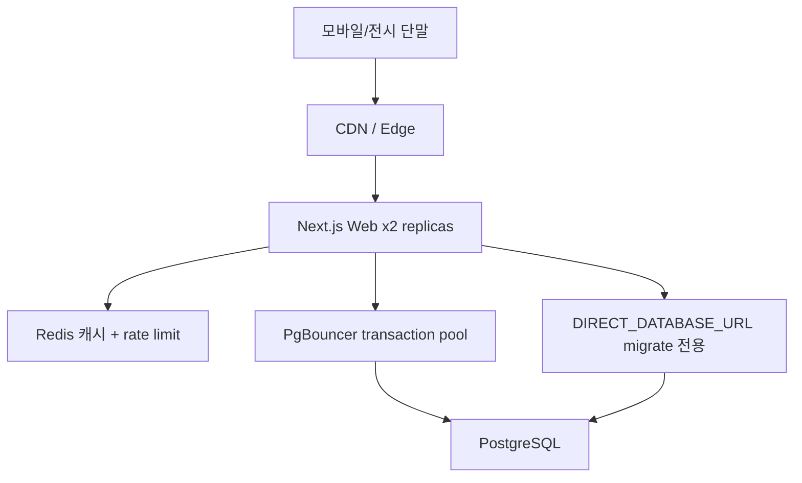

<callout icon="📄" color="blue_bg">
	**문서 번호:** YKGAME-2026-002
	**작성일:** 2026년 7월 13일
	**수신:** YK건기 (주)
	**관련 문서:** 초기 MVP 견적 YKGAME-2026-001 (115 MD)
	**유효기간:** 제출일로부터 30일
	**단가 기준:** 1 MD = ₩1,000,000 (VAT 별도) — 초기 견적과 동일
</callout>
<table_of_contents/>
---
# 1. 제안 개요
## 1.1 제안 배경
초기 MVP(문서 YKGAME-2026-001)는 8종 브랜드 캐주얼 미니게임 + 회원·랭킹·관리자를 목표로 했습니다. 이후 개발 과정에서 제품 방향이 고도화되어, 현재는 다음 세 축을 중심으로 한 **YK건기 브랜드 체험 플랫폼**으로 진화했습니다.
1. **체험 탑승** — 실제 장비 조작에 가까운 운전실 시뮬레이터
2. **이벤트 전용 게임** — 전시·시즌·프로모션용 단발성 콘텐츠
3. **얀마! 너 뭐해?** — 롤플레잉형 반복 플레이 게임 (퀘스트·강화·상점·시즌 보상)
동시에 전시·행사·전국 센터 유입을 고려해 **동시접속 1,000명(CCU)** 을 안정적으로 버티는 서버·인프라 구조가 필요합니다.
## 1.2 본 문서의 목적
본 제안서는 (1) **지금까지 구현된 산출물**을 명확히 정리하고, (2) 위 세 축 + **1,000 CCU** 를 완성하기 위한 **추가 개발 범위·일정·견적**을 YK건기에 제안합니다.
## 1.3 핵심 가치
<table fit-page-width="true" header-row="true">
<tr>
<td>가치</td>
<td>설명</td>
</tr>
<tr>
<td>실감 체험</td>
<td>실제 조작계(조이스틱·페달·어태치먼트)에 가까운 탑승 체험으로 브랜드·제품 이해도 향상</td>
</tr>
<tr>
<td>반복 참여</td>
<td>얀마! 너 뭐해? RPG 루프로 재방문·시즌 경쟁·쿠폰 리워드 유도</td>
</tr>
<tr>
<td>행사 유연성</td>
<td>이벤트 전용 단발 게임으로 전시·시즌·프로모션에 빠르게 대응</td>
</tr>
<tr>
<td>운영 안정성</td>
<td>1,000 CCU 기준 Redis·PgBouncer·CDN·수평 확장으로 피크 트래픽 대응</td>
</tr>
<tr>
<td>운영 효율</td>
<td>관리자 패널로 회원·재화·메일·공지·문의·확률/퀘스트 조회</td>
</tr>
</table>
---
# 2. 지금까지 구현한 내용 (현황)
<callout icon="✅" color="green_bg">
	초기 MVP 범위를 상회하는 **플랫폼·얀마 3D·경제·관리자·스케일 설계**가 이미 상당 부분 구현되어 있습니다. 아래는 2026년 7월 기준 코드베이스 현황입니다.
</callout>
## 2.1 구현 완료 요약
<table fit-page-width="true" header-row="true">
<tr>
<td>영역</td>
<td>성숙도</td>
<td>주요 산출물</td>
</tr>
<tr>
<td>랜딩·PWA·체험 진입</td>
<td>완료</td>
<td>공개 랜딩, QR/홈화면 추가, 탑승 vs 게임 체험 분기</td>
</tr>
<tr>
<td>회원·인증</td>
<td>완료 (OAuth 제외)</td>
<td>가입·로그인·닉네임, NextAuth JWT, 제재(활성/비활성)</td>
</tr>
<tr>
<td>얀마 3D 시뮬레이터</td>
<td>고도화 단계</td>
<td>굴착·하역·브레이커·석재, 연습/랭킹/탑승 모드</td>
</tr>
<tr>
<td>얀마! 너 뭐해? 경제·RPG 기반</td>
<td>핵심 루프 완료</td>
<td>퀘스트, 장비 강화, 상점 버프, 스타·XP·쿠폰, 시즌 통계</td>
</tr>
<tr>
<td>체험 탑승 (얀마)</td>
<td>기본~중급</td>
<td>저속 운전실 모드, 점수/랭킹 비초점, 종료 후 랜딩 복귀</td>
</tr>
<tr>
<td>관리자</td>
<td>완료</td>
<td>회원·재화·쿠폰·메일·문의·공지(티커)·확률/퀘스트/워크숍 조회</td>
</tr>
<tr>
<td>인프라·배포</td>
<td>운영 가능</td>
<td>Railway + Postgres, 자동 migrate/seed, /api/health</td>
</tr>
<tr>
<td>1,000 CCU 설계</td>
<td>코드·문서 완료 / 인프라 체크리스트 미완</td>
<td>DB pool, Redis 캐시·rate limit, k6 부하 스크립트, 운영 가이드</td>
</tr>
<tr>
<td>나머지 7종 브랜드</td>
<td>카탈로그 + 스텁</td>
<td>Phaser 플레이스홀더만, 실서비스 플레이 비활성</td>
</tr>
<tr>
<td>이벤트 전용 게임</td>
<td>미착수</td>
<td>스케줄·단발 보상·이벤트 CMS 없음</td>
</tr>
</table>
## 2.2 기술 스택 (현재)
```text
모바일 브라우저 / PWA
        ↓
Next.js 16 (App Router) + React 19 + Tailwind 4
얀마: Three.js + React Three Fiber
기타 브랜드(예정): Phaser 4
        ↓ REST API (폴링 티커)
NextAuth v5 (JWT) + Prisma 7 + PostgreSQL
Redis (선택, 캐시·dump rate limit)
        ↓
Railway (Web + Postgres) — CDN/PgBouncer/Replica는 체크리스트 단계
```
## 2.3 이미 확보된 스케일 기반
- JWT 세션 → 다중 인스턴스에서도 sticky session 불필요
- 보상/점수 멱등성(RewardEvent, sessionId) + pg_advisory_xact_lock (PgBouncer transaction pooling 호환)
- 랭킹·stats Redis 공유 캐시 + 로컬 TTL fallback
- dump API token bucket rate limit (Redis)
- k6 부하: smoke → 100→300→500→1,000 VU mixed/soak
- 합격 기준: http_req_failed &lt; 1%, p95 &lt; 300ms, p99 &lt; 1s
## 2.4 초기 견적 대비 진척
<table fit-page-width="true" header-row="true">
<tr>
<td>초기 MVP 항목</td>
<td>현황</td>
</tr>
<tr>
<td>플랫폼·인증·관리자·배포</td>
<td>완료 (관리자·운영 기능은 초기 범위보다 확장)</td>
</tr>
<tr>
<td>Phaser 8종 미니게임</td>
<td>얀마는 3D RPG형으로 대체·고도화 / 나머지 7종은 스텁</td>
</tr>
<tr>
<td>선택 옵션이었던 상점·강화</td>
<td>얀마 기준으로 이미 구현</td>
</tr>
<tr>
<td>PWA</td>
<td>이미 구현</td>
</tr>
</table>
---
# 3. 앞으로의 방향 (제안 범위)
본 추가 개발은 아래 **4개 워크스트림**으로 구성합니다.
## 3.1 WS-A. 체험 탑승 — 실제처럼
**목표:** 전시·센터 방문객이 실제 얀마 굴착기를 탄 듯한 조작감을 느끼도록 운전실 시뮬레이터를 고도화합니다.
### 포함 범위
- 실제 장비 조작계 매핑 고도화 (붐 스윙 페달, PTO(브레이커/집게) 좌우 페달, 블레이드 레버 위치 등)
- 카메라·모델 스케일·캐노피·모델명(ViO17-1 등) 등 제품 고증 반영
- 탑승 전용 UX (점수/랭킹 배제, 저장 후 종료, 키오스크/전시 모드)
- 튜토리얼·조작 가이드·안전/브랜드 카피 연동
- 모바일·태블릿·전시용 대형 터치 디스플레이 대응 QA
### 산출물
- 얀마 탑승 체험 프로덕션급 빌드
- 조작 매핑·고증 체크리스트 (YK건기 검수용)
- 전시/키오스크 운영 가이드
### 범위 외 (옵션)
- 나머지 7브랜드 3D 탑승 (브랜드당 별도 견적)
- 실기 캐비닛·하드웨어 I/O 연동
## 3.2 WS-B. 얀마! 너 뭐해? — 롤플레잉 게임 확장
**목표:** 이미 구축된 퀘스트·강화·상점·시즌 보상을 스토리·역할·장기 성장이 느껴지는 RPG로 확장합니다.
### 포함 범위
- 롤플레이 서사/미션 라인 (일일·주간·시즌 스토리 퀘스트)
- 성장 체감 강화 (레벨·칭호·작업 숙련도·장비 카테고리 재편: 작업장치/어태치먼트 등)
- 시즌 패스형 목표·랭킹 시즌 운영 툴 보강
- 우편·인벤토리·쿠폰과 연동된 보상 연출
- 라이브옵스용 밸런스(확률·퀘스트) 운영 개선
### 산출물
- RPG 콘텐츠 패키지 v1 (퀘스트 테이블·카피·보상 곡선)
- 장비 강화 UI 카테고리 개선
- 시즌 운영 매뉴얼
## 3.3 WS-C. 이벤트 전용 게임 (단발성)
**목표:** 전시회·시즌 프로모션·센터 이벤트에만 열리는 단발 게임을 빠르게 올리고 내릴 수 있는 구조를 만듭니다.
### 포함 범위
- 이벤트 게임 프레임워크 (일정·오픈/마감, 참여 조건, 1회/N회 제한, 전용 보상)
- 관리자 이벤트 등록·노출·종료·결과 집계
- 플래그십 이벤트 게임 2종 제작 (예: 전시 미니미션 + 시즌 스페셜)
- 랜딩/티커/메일과 이벤트 연계
- 이벤트 종료 후 아카이브·재오픈 정책
### 산출물
- Event Game 스키마·API·관리자 화면
- 이벤트 게임 2종 + 재사용 템플릿 1종
- 행사 운영 플레이북
## 3.4 WS-D. 동시접속 1,000명 구조 완성
**목표:** 코드에 이미 있는 스케일 설계를 실제 인프라·증거·운영 절차까지 완성합니다.
### 포함 범위
- Staging/Production Redis 프로비저닝 및 공유 캐시·rate limit 검증
- PgBouncer (transaction pooling) + 연결 예산 설계
- CDN(Cloudflare 등) — 정적 3D/이미지 원본 부하 분리
- Web 수평 확장(2 replica) 승인·soak 시험
- k6 1,000 VU ramp/soak 결과 리포트 및 병목 튜닝
- 관측(헬스·풀·API latency)·롤백 런북 정리
### 합격 기준
- http_req_failed &lt; 1%
- p95 &lt; 300ms / p99 &lt; 1s (핵심 API)
- Redis fail-open·PgBouncer rollback 절차 문서화
### 참고
클라이언트 GPU 부하(3D)는 서버 CCU와 별개입니다. 본 WS는 서버·API·DB·CDN 기준이며, 전시 단말 권장 사양은 별도 가이드로 제공합니다.
---
# 4. 아키텍처 제안 (1,000 CCU)

<table fit-page-width="true" header-row="true">
<tr>
<td>계층</td>
<td>역할</td>
<td>1,000 CCU 대응</td>
</tr>
<tr>
<td>CDN</td>
<td>정적 에셋</td>
<td>원본 대역폭·빌드 자산 부하 완화</td>
</tr>
<tr>
<td>Web replica</td>
<td>SSR/API</td>
<td>JWT로 무상태 확장, health 기반 롤링</td>
</tr>
<tr>
<td>Redis</td>
<td>랭킹 캐시·dump 제한</td>
<td>인스턴스 간 일관성, 남용 방지</td>
</tr>
<tr>
<td>PgBouncer</td>
<td>DB 연결 다중화</td>
<td>replica 증가 시 연결 고갈 방지</td>
</tr>
<tr>
<td>Postgres</td>
<td>진실의 원천</td>
<td>멱등 보상·시즌 집계·트랜잭션 안전</td>
</tr>
</table>
---
# 5. 추진 일정
총 기간: **약 14~18주** (1~2인 기준, 병행 시 단축 가능)
<table fit-page-width="true" header-row="true">
<tr>
<td>Phase</td>
<td>기간</td>
<td>주요 작업</td>
<td>산출</td>
</tr>
<tr>
<td>Phase 0 재기획·고증</td>
<td>1.5주</td>
<td>탑승 고증·RPG 서사·이벤트 정책·CCU 목표 확정</td>
<td>확정 기획서·검수 체크리스트</td>
</tr>
<tr>
<td>Phase 1 탑승 고도화</td>
<td>4~5주</td>
<td>조작계·모델·카메라·키오스크 UX</td>
<td>탑승 체험 v2</td>
</tr>
<tr>
<td>Phase 2 RPG 확장</td>
<td>3~4주</td>
<td>서사 퀘스트·성장·시즌·강화 UI</td>
<td>얀마! 너 뭐해? v2</td>
</tr>
<tr>
<td>Phase 3 이벤트 프레임+2종</td>
<td>3~4주</td>
<td>이벤트 시스템·관리자·게임 2종</td>
<td>이벤트 런칭 가능</td>
</tr>
<tr>
<td>Phase 4 1,000 CCU 인프라</td>
<td>2~3주</td>
<td>Redis/PgBouncer/CDN/replica/soak</td>
<td>시험 리포트·런북</td>
</tr>
<tr>
<td>Phase 5 QA·인수</td>
<td>1.5~2주</td>
<td>통합 QA·UAT·전시 리허설</td>
<td>운영 오픈</td>
</tr>
</table>
Phase 1~4는 인력에 따라 일부 병행 가능합니다. (예: 인프라 Phase 4를 Phase 1과 병행)
---
# 6. 견적 내역
## 6.1 공수 산정 기준
- 1 M/M = 20 MD
- 적용 단가: **1 MD = ₩1,000,000 (VAT 별도)**
- 본 견적은 **추가 개발(YKGAME-2026-002)** 기준이며, 이미 구현된 플랫폼·얀마 핵심 루프 공수는 포함하지 않습니다.
## 6.2 Phase별 공수 및 금액
<details>
<summary>Phase 0 — 재기획·고증 (12 MD / ₩12,000,000)</summary>
	<table fit-page-width="true" header-row="true">
	<tr>
	<td>항목</td>
	<td>공수(MD)</td>
	<td>금액(원)</td>
	</tr>
	<tr>
	<td>탑승 조작·제품 고증 워크숍</td>
	<td>4</td>
	<td>4,000,000</td>
	</tr>
	<tr>
	<td>RPG 서사·시즌·보상 설계</td>
	<td>4</td>
	<td>4,000,000</td>
	</tr>
	<tr>
	<td>이벤트 정책·CCU/인프라 확정</td>
	<td>4</td>
	<td>4,000,000</td>
	</tr>
	</table>
</details>
<details>
<summary>Phase 1 — 체험 탑승 실제처럼 (42 MD / ₩42,000,000)</summary>
	<table fit-page-width="true" header-row="true">
	<tr>
	<td>항목</td>
	<td>공수(MD)</td>
	<td>금액(원)</td>
	</tr>
	<tr>
	<td>실기 조작계 매핑·페달/레버 고도화</td>
	<td>14</td>
	<td>14,000,000</td>
	</tr>
	<tr>
	<td>모델·카메라·캐노피·스케일 고증</td>
	<td>12</td>
	<td>12,000,000</td>
	</tr>
	<tr>
	<td>탑승 UX·키오스크/전시 모드</td>
	<td>8</td>
	<td>8,000,000</td>
	</tr>
	<tr>
	<td>튜토리얼·카피·디바이스 QA</td>
	<td>8</td>
	<td>8,000,000</td>
	</tr>
	</table>
</details>
<details>
<summary>Phase 2 — 얀마! 너 뭐해? RPG 확장 (38 MD / ₩38,000,000)</summary>
	<table fit-page-width="true" header-row="true">
	<tr>
	<td>항목</td>
	<td>공수(MD)</td>
	<td>금액(원)</td>
	</tr>
	<tr>
	<td>스토리/롤플레이 퀘스트 라인</td>
	<td>12</td>
	<td>12,000,000</td>
	</tr>
	<tr>
	<td>성장·칭호·시즌 목표 시스템</td>
	<td>10</td>
	<td>10,000,000</td>
	</tr>
	<tr>
	<td>장비 카테고리(작업장치/어태치먼트) 개편</td>
	<td>8</td>
	<td>8,000,000</td>
	</tr>
	<tr>
	<td>보상 연출·라이브옵스 툴 보강</td>
	<td>8</td>
	<td>8,000,000</td>
	</tr>
	</table>
</details>
<details>
<summary>Phase 3 — 이벤트 전용 게임 (36 MD / ₩36,000,000)</summary>
	<table fit-page-width="true" header-row="true">
	<tr>
	<td>항목</td>
	<td>공수(MD)</td>
	<td>금액(원)</td>
	</tr>
	<tr>
	<td>이벤트 프레임워크·DB·API</td>
	<td>10</td>
	<td>10,000,000</td>
	</tr>
	<tr>
	<td>관리자 이벤트 CMS·집계</td>
	<td>6</td>
	<td>6,000,000</td>
	</tr>
	<tr>
	<td>이벤트 게임 2종 제작</td>
	<td>16</td>
	<td>16,000,000</td>
	</tr>
	<tr>
	<td>재사용 템플릿·랜딩/티커 연동</td>
	<td>4</td>
	<td>4,000,000</td>
	</tr>
	</table>
</details>
<details>
<summary>Phase 4 — 1,000 CCU 인프라 완성 (22 MD / ₩22,000,000)</summary>
	<table fit-page-width="true" header-row="true">
	<tr>
	<td>항목</td>
	<td>공수(MD)</td>
	<td>금액(원)</td>
	</tr>
	<tr>
	<td>Redis staging/prod 구축·검증</td>
	<td>4</td>
	<td>4,000,000</td>
	</tr>
	<tr>
	<td>PgBouncer·연결 예산·마이그레이션 분리</td>
	<td>5</td>
	<td>5,000,000</td>
	</tr>
	<tr>
	<td>CDN·캐시 경계·퍼지/롤백</td>
	<td>4</td>
	<td>4,000,000</td>
	</tr>
	<tr>
	<td>2 replica + k6 1,000 VU soak·튜닝</td>
	<td>6</td>
	<td>6,000,000</td>
	</tr>
	<tr>
	<td>관측·런북·인수 리포트</td>
	<td>3</td>
	<td>3,000,000</td>
	</tr>
	</table>
</details>
<details>
<summary>Phase 5 — QA·UAT·런칭 (14 MD / ₩14,000,000)</summary>
	<table fit-page-width="true" header-row="true">
	<tr>
	<td>항목</td>
	<td>공수(MD)</td>
	<td>금액(원)</td>
	</tr>
	<tr>
	<td>통합 테스트·버그 수정</td>
	<td>6</td>
	<td>6,000,000</td>
	</tr>
	<tr>
	<td>모바일·전시 단말 QA</td>
	<td>4</td>
	<td>4,000,000</td>
	</tr>
	<tr>
	<td>UAT·전시 리허설·인수</td>
	<td>4</td>
	<td>4,000,000</td>
	</tr>
	</table>
</details>
## 6.3 견적 요약
<callout icon="💰" color="green_bg">
	**합계: 164 MD / ₩164,000,000 (VAT 별도)**
	**VAT(10%) 포함 시: ₩180,400,000**
</callout>
<table fit-page-width="true" header-row="true">
<tr>
<td>Phase</td>
<td>공수(MD)</td>
<td>금액(원)</td>
</tr>
<tr>
<td>Phase 0 재기획·고증</td>
<td>12</td>
<td>12,000,000</td>
</tr>
<tr>
<td>Phase 1 체험 탑승</td>
<td>42</td>
<td>42,000,000</td>
</tr>
<tr>
<td>Phase 2 RPG 확장</td>
<td>38</td>
<td>38,000,000</td>
</tr>
<tr>
<td>Phase 3 이벤트 게임</td>
<td>36</td>
<td>36,000,000</td>
</tr>
<tr>
<td>Phase 4 1,000 CCU</td>
<td>22</td>
<td>22,000,000</td>
</tr>
<tr>
<td>Phase 5 QA·인수</td>
<td>14</td>
<td>14,000,000</td>
</tr>
<tr>
<td>**합계**</td>
<td>**164 MD**</td>
<td>**₩164,000,000**</td>
</tr>
</table>
## 6.4 패키지 선택형 (권장)
전체 일괄 계약 외에, 우선순위에 따른 **패키지 분리 계약**도 가능합니다.
<table fit-page-width="true" header-row="true">
<tr>
<td>패키지</td>
<td>포함</td>
<td>공수</td>
<td>금액(원)</td>
</tr>
<tr>
<td>**P-A 탑승 실감화**</td>
<td>Phase 0(일부) + Phase 1 + QA 배분</td>
<td>52</td>
<td>52,000,000</td>
</tr>
<tr>
<td>**P-B RPG 확장**</td>
<td>Phase 0(일부) + Phase 2 + QA 배분</td>
<td>48</td>
<td>48,000,000</td>
</tr>
<tr>
<td>**P-C 이벤트 게임**</td>
<td>Phase 0(일부) + Phase 3 + QA 배분</td>
<td>46</td>
<td>46,000,000</td>
</tr>
<tr>
<td>**P-D 1,000 CCU**</td>
<td>Phase 4 + 인프라 QA</td>
<td>25</td>
<td>25,000,000</td>
</tr>
<tr>
<td>**풀패키지**</td>
<td>Phase 0~5 전체</td>
<td>164</td>
<td>164,000,000</td>
</tr>
</table>
패키지 단독 진행 시 Phase 0·5 공수가 중복되지 않도록 착수 전 재배분합니다. 위 표는 단독 발주 시 대략 단가입니다.
## 6.5 선택 옵션 (별도 견적)
<table fit-page-width="true" header-row="true">
<tr>
<td>옵션</td>
<td>공수(MD)</td>
<td>예상 금액(원)</td>
<td>설명</td>
</tr>
<tr>
<td>O-1 카카오·구글 로그인</td>
<td>5</td>
<td>5,000,000</td>
<td>OAuth 실연동 (현재 스텁)</td>
</tr>
<tr>
<td>O-2 나머지 7종 Phaser 미니게임 완성</td>
<td>28~35</td>
<td>28,000,000~35,000,000</td>
<td>초기 MVP 잔여 브랜드</td>
</tr>
<tr>
<td>O-3 추가 브랜드 3D 탑승 (종당)</td>
<td>25~40</td>
<td>25,000,000~40,000,000</td>
<td>얀마 수준 고증 탑승</td>
</tr>
<tr>
<td>O-4 이벤트 게임 추가 (종당)</td>
<td>6~10</td>
<td>6,000,000~10,000,000</td>
<td>템플릿 기반 제작</td>
</tr>
<tr>
<td>O-5 관리자 통계 대시보드</td>
<td>8</td>
<td>8,000,000</td>
<td>DAU·게임별·이벤트 리포트</td>
</tr>
<tr>
<td>O-6 프로덕션 3D/사운드 에셋</td>
<td>20~50</td>
<td>20,000,000~50,000,000</td>
<td>외주 아트·사운드 포함 시</td>
</tr>
<tr>
<td>O-7 유지보수 (월)</td>
<td>3~6 MD/월</td>
<td>3,000,000~6,000,000/월</td>
<td>버그·소규모 개선·이벤트 지원</td>
</tr>
</table>
---
# 7. 대금 지급 조건 (풀패키지 기준)
<table fit-page-width="true" header-row="true">
<tr>
<td>차수</td>
<td>시점</td>
<td>비율</td>
<td>금액(원, VAT 별도)</td>
</tr>
<tr>
<td>1차</td>
<td>계약 체결</td>
<td>30%</td>
<td>49,200,000</td>
</tr>
<tr>
<td>2차</td>
<td>Phase 1·2 완료 (탑승 + RPG)</td>
<td>30%</td>
<td>49,200,000</td>
</tr>
<tr>
<td>3차</td>
<td>Phase 3·4 완료 (이벤트 + 1,000 CCU)</td>
<td>30%</td>
<td>49,200,000</td>
</tr>
<tr>
<td>4차</td>
<td>최종 검수·인수</td>
<td>10%</td>
<td>16,400,000</td>
</tr>
<tr>
<td>합계</td>
<td></td>
<td>100%</td>
<td>164,000,000</td>
</tr>
</table>
- 세금계산서 발행 후 15영업일 이내 지급
- 패키지 분리 계약 시 동일 비율을 해당 패키지 금액에 적용
---
# 8. 가정 및 전제 조건
1. 장비 조작 고증·모델명·외형 수정 기준은 **YK건기 실무 검수**를 통해 확정합니다.
2. 브랜드 로고·제품 이미지·매뉴얼 등 에셋은 발주처 제공을 원칙으로 합니다.
3. Railway·Redis·CDN·도메인·SSL 등 **클라우드 이용료는 발주처 부담**입니다. (1,000 CCU 운영 시 월 비용은 트래픽에 따라 변동, 착수 시 예상치 제시)
4. 요구사항 변경은 Change Request로 공수·일정·비용을 재협의합니다.
5. UAT 2회 이내 무상 수정, 3회째부터 추가 공수입니다.
6. 동시접속 1,000명은 **서버 API/DB 기준**이며, 모든 단말이 동시에 고사양 3D를 돌리는 클라이언트 성능 보장은 포함하지 않습니다.
---
# 9. 품질·보증
<table fit-page-width="true" header-row="true">
<tr>
<td>항목</td>
<td>내용</td>
</tr>
<tr>
<td>하자 보증</td>
<td>최종 인수 후 3개월 무상 하자 보수 (제안사 귀책)</td>
</tr>
<tr>
<td>지원 대상</td>
<td>기능 오류, 배포 실패, API·DB·캐시 연동 장애</td>
</tr>
<tr>
<td>지원 제외</td>
<td>발주처 인프라 장애, 요구사항 변경, 제3자(Railway/CDN) 장애</td>
</tr>
<tr>
<td>성능 보증</td>
<td>합의된 staging 환경에서 k6 기준 통과 증거 제공</td>
</tr>
</table>
---
# 10. 기대 효과
<table fit-page-width="true" header-row="true">
<tr>
<td>영역</td>
<td>기대 효과</td>
</tr>
<tr>
<td>영업·전시</td>
<td>실감 탑승으로 제품 설명 없이도 장비 이해·관심 유도</td>
</tr>
<tr>
<td>마케팅</td>
<td>이벤트 단발 게임으로 시즌·전시마다 신규 유입 장치 확보</td>
</tr>
<tr>
<td>고객 락인</td>
<td>RPG 루프·시즌 보상·쿠폰으로 재방문과 센터 연계</td>
</tr>
<tr>
<td>운영</td>
<td>1,000 CCU급 행사 피크에도 안정적 서비스</td>
</tr>
</table>
---
# 11. 결론
현재 YK건기 체험 플랫폼은 **랜딩·회원·관리자·얀마 3D 핵심 루프·탑승 기본·스케일 설계**까지 확보한 상태입니다.
본 추가 제안은 그 위에
1. **체험 탑승을 실제 장비처럼**,
2. **얀마! 너 뭐해?를 본격 RPG로**,
3. **이벤트 단발 게임을 운영 가능한 구조로**,
4. **동시접속 1,000명을 인프라로 증명**하는
완성을 목표로 합니다.
<callout icon="📌" color="yellow_bg">
	**권장:** 전시·센터 임팩트가 큰 **P-A(탑승) + P-D(1,000 CCU)** 를 우선 착수하고, 이어서 **P-B(RPG)** · **P-C(이벤트)** 를 단계 오픈하는 방식을 제안드립니다.
</callout>
---
# 부록 A. 초기 견적과의 관계
<table fit-page-width="true" header-row="true">
<tr>
<td>구분</td>
<td>문서</td>
<td>금액</td>
</tr>
<tr>
<td>초기 MVP</td>
<td>YKGAME-2026-001</td>
<td>115 MD / ₩115,000,000</td>
</tr>
<tr>
<td>추가 개발 (본 문서)</td>
<td>YKGAME-2026-002</td>
<td>164 MD / ₩164,000,000</td>
</tr>
</table>
초기 MVP에서 약속한 플랫폼 기반과 얀마 고도화 상당 부분은 이미 구현되어 있으며, 본 견적은 **잔여·고도화·신규 축(이벤트·실감 탑승·CCU 증명)** 에 대한 추가 제안입니다. 기 투입 분과의 정산·상계는 계약 협의 시 별도 조정할 수 있습니다.
# 부록 B. 관련 산출물
- 코드 저장소: GitHub BlueStarAcademy/ykgame
- 스케일 가이드: 프로젝트 내 docs/scale-1000-ccu.md
- 기획 참고: YK건기 캐주얼 미니게임 기획안 (260619)
---
<callout icon="✍️" color="gray_bg">
	*본 문서는 YK건기 체험 플랫폼 추가 개발에 대한 제안 및 견적이며, 계약 체결 전 참고용입니다. 금액·범위는 협의에 따라 조정 가능합니다.*
</callout>
